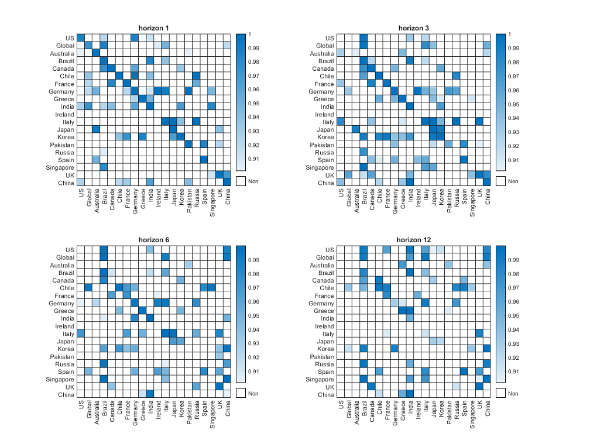

# Working Papers

* <b> “Counterfactual analysis in macroeconomics: theory and inference” </b> _sole author_, June 2024, 38 pages. (<b>Job Market Paper</b>)   
      This paper recasts two prominent macroeconomic counterfactuals—hypothetical trajectory and policy intervention—within the potential outcome time series framework. Our analysis demonstrates that policy intervention and hypothetical trajectory, respectively, correspond to direct and indirect dynamic causal effects, under the structural interpretation that hypothetical variable performance is the consequence of manipulating the corresponding policy shocks. We provide unique analytical solutions for the counterfactual parameters used in these exercises by employing a semiparametric structural model. Aligned with the empirical macroeconometric literature, we present a local projection-instrumental variable (LP-IV) based identification and estimation method for these parameters. The asymptotic theory for these parameter estimates is derived with two methods for covariance matrix estimation: the classic approach using an Heteroskedastic and Autocorrelation Consistent/Robust (HAC/HAR) estimate, and an innovative alternative using the Eicker–Huber–White Heteroskedastic Robust (HR) estimate, which remains valid regardless of serially correlated projection residuals. To address potential issues stemming from weak instruments, we present Anderson-Rubin type test-reversed confidence intervals. Utilizing high-frequency external instruments for monetary policy shocks (Gertler and Karadi, 2015), we (1) assess scenario analyses wherein interest rates follow a hypothetical trajectory in the post-pandemic era, and (2) scrutinize the macroeconomic aggregates' response to an inflation shock under the restriction of the central bank holding interest rates constant. This facilitates an evaluation of the costs and benefits associated with central banks' efforts to tackle high inflation rates in the post-pandemic era through the manipulation of interest rate as a policy variable. 
     

* <b>‘‘Simple robust two-stage estimation and inference for generalized impulse responses and multiple-horizon causality’’</b> with Jean-Marie Dufour (McGill University). Feb 2024, 96 pages.  
     In economics and finance, researchers often conduct prediction, multi-horizon Granger causality tests, and Granger causality measurement using generalized impulse responses (GIRs). GIRs refer to all coefficients in a linear projection model of future outcomes of $y$ on lagged values at given horizon $h$ (Dufour and Renault, 1998). Use of standard Least Square (LS) with  Heteroskedasticity and autocorrelation consistent (HAC) covariance matrix estimation often leads to unreliable inference results, complicated further by the difficulty of bandwidth selection when estimating HAC standard errors. In this paper, a novel two-stage estimation and inference method for GIRs is introduced. The estimation method uses VAR residuals as instrumental variables in a two-stage LS procedure. We show that our two-stage method outperforms the standard LS method in two respects: (1) the two-stage estimates are generally more efficient than the standard LS estimates for a wide range of projection horizon and parameter space. (2) our proposed covariance matrix estimation method utilizes Eicker–Huber–White standard error rather than HAC standard error, and therefore provides better robustness in small samples, despite the fact that the residual of $h$-horizon projection is serially correlated. Moreover, the lag-augmented two-stage estimates are proposed to accommodate persistent data processes, such as I(1) and I(2) processes. Furthermore, our inference results allow for the projection horizon to grow with the sample size at a speed contingent upon data persistency. This is suitable for macroeconomic time series exercises, in which the projection horizon typically constitutes a significant portion of the sample size. This study also discusses Monte Carlo tests and bootstrapping techniques to improve the reliability of inference in finite samples. We demonstrate the effectiveness of these techniques through Monte Carlo simulations. Finally, we implement the proposed two-stage estimation method to investigate the multi-horizon causality from economic uncertainty to economic activity measure. Our analysis reveals that economic uncertainty exerts a longer-than-anticipated influence on economic activities.
    
  
* <b> “Causal mechanism and mediation analysis for macroeconomics dynamics”  </b> with Jean-Marie Dufour (McGill University). Nov 2023, 30 pages.  
        _previous title “Intervention analysis, causality and generalized impulse responses in VAR models: theory and inference”_  
        We investigate the causal mechanism in a dynamic model and propose an innovative index designed to offer a quantitative measure for the mediator during causal transmission. The study focuses on the counterfactual scenario where the causal coefficients from the mediator to the output variable are suppressed to zero. The empirical application examines the causal transmission from an inflation shock to GDP through FFR, labor, consumption, and investment.   

* <b> ‘‘Inference in High-Dimensional Linear Projections: Multi-Horizon Granger Causality and Network Connectedness’’</b> with Eugène  Dettaa (Université de Montréal).   
      This paper provides methodologies for de-biased estimation and honest inference for a finite number of coefficients of interest in a high-dimensional (HD) local projection (LP) equation. The HD time series is assumed to follow a finite-order sparse Vector Autoregression (VAR) model. Our work addresses the econometric difficulty that a sparse VAR does not necessarily yield a sparse LP. Consequently, it highlights concerns regarding the implementation of post-double-selection Least Absolute Shrinkage and Selection Operator (LASSO) with arbitrarily strong sparsity assumptions on HD LP for all horizons. In this paper, we introduce two types of de-biased estimation and inference methods. The first is the de-biased Least Squares method with heteroskedasticity- and autocorrelation-consistent (HAC) inference. Given that HAC inference exhibits relatively poor performance in terms of coverage ratio for confidence intervals constructed with $z$-score critical values from a standard Gaussian distribution, we propose a second method: a two-stage estimation with Eicker–Huber–White heteroskedasticity-robust inference under a slightly stronger assumption, irrespective of serially correlated residuals. In Monte Carlo simulations, we demonstrate that our two estimation methods outperform post-double-selection estimates in terms of coverage ratio. Furthermore, we observe that as the projection horizon increases, the two-stage estimates maintain a more robust coverage ratio than the LS estimates, which aligns with simulations verified in a low-dimensional setup (Dufour and Wang, 2024). Finally, we apply our methodology to test multi-horizon Granger causality for the country-level economic uncertainty index (Baker, Bloom, and Davis, 2016) and construct a network of connectedness across multiple horizons. Our empirical exercise reveals that China has a causal effect on the US in the short run (1 and 3 months), while the US, in turn, affects China in the long run (9 and 12 months).
  

# Work in Progress

* <b> “Inference on time-varying impulse responses in high dimensional state-dependent VAR” </b>  
   This paper derives asymptotic inferences on time-varying impulse responses in a high-dimensional, state-dependent VAR model under the sparsity assumption. Our research reveals a general non-equivalence between VAR and local projections in the context of non-linearity. This finding suggests that state-dependent local projections have less solid theoretical justification compared to the linear case, despite their common application in empirical research. Consequently, our methodology for impulse response estimation in a non-linear setup is grounded in state-dependent VAR, which results in the impulse response parameters being time-varying and dependent on the state of the economy. Our econometric contribution includes the proposal of a pseudo-local projection (pseudo-LP) method to estimate these time-varying impulse responses while eliminating bias arising from penalized estimation due to high dimensionality. In summary, we present de-biased, time-varying impulse responses with reliable inferences.  

* <b> “Generic identification and practical specification for multivariate time series” </b>  
    This paper investigates the generic identification conditions for the vector autoregressive moving average (VARMA) model and presents a practical specification algorithm. Our goal is to offer a flexible VARMA representation as a complement to the rigorous Echelon form. We apply this methodology to impulse response estimation, achieving narrower confidence bands compared to VAR estimation. 

* <b> “The (mis)-identification and estimation of structural impulse responses in sub-space VAR model”</b>  
   This paper investigates the effects of impulse response misidentification and estimation under a sub-space VAR model employing Structural VAR (SVAR) and Local Projection (LP). We investigate the bias-variance trade-off between SVAR and LP impulse response estimates under a subspace VAR process. 
